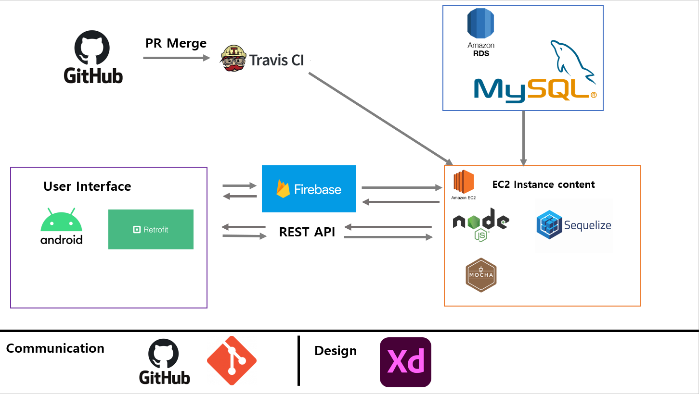

# belinkServer
##세종대학교 캡스톤
[](https://travis-ci.com/VIXXPARK/belinkServer)
------------------------
```
1.  url 규칙은 api/를 시작으로 하며 그 다음 순서는 각 주요 데이터베이스 테이블 네임
    과 관련된 키워드 user, location, notice, prediction 등으로 시작한다.
2.  url/keyword/ 다음에 해당 기능들을 표시화는데, 최대한 명사형으로 적으며 작성방식은
    noun1-noun2-noun3 식으로 '-'하이픈 연결 방식으로 진행한다.
3.  작성 방식은
api
----user
    -controller.js
    -index.js
    형식으로 작성하며 controller 부분에는
    exports.camelName= (req,res,next)=>{}
    식으로 작성한다. 그리고 controller부분에는 카멜형식으로 네이밍한다.
    
    index부분에는 router를 생성하고 해당 controller에 맞는 url과 method를 선정하고 
    router.post('/get-user',controller.getUser)식으로 작성한다.
```

```
1.  자기 닉네임으로 branch로 두고 변경사항이 있을 때마다 branch에 push한다
2.  github에 들어가서 pullRequest를 한 다음에 변경사항을 자세히 적는다.
3.  예를 들어 api/user/get-user를 작성했다면 이러한 것을 작성했고, 안된다면 issues를 활용하여 어느 것이 안되는지
    알리도록 하자
```

```
1. 데이터베이스를 설정할 때 window 환경에서는 set NODE_ENV=test or development or production으로 지정해서 하자
2. 리눅스 환경에서는 export NODE_ENV=production or test or development 이다.
```
## 역할 분담

|박수한|김경재|김민섭|
|------|------|------|
|서버담당|...|kakao api 사용|
|DB설계|DB설계|DB설계|
|CI/CD|Firebase연동|의사결정트리 작성|
|User기능담당|Push서비스담당|Store/sms/location 담당|
|mocha를 통한 테스트 주도 개발|...|네이버api 사용|


## 기술 스택



1. Nodejs
2. mocha framework를 통한 테스트 주도 개발
3. travis-ci를 통한 빌드 테스트 
4. aws ec2 와 rds를 통한 서버 구축
5. firebase를 통해 push서비스 구현
6. naver api를 연동하여 sms서비스 구현
7. kakao api를 연동하여 가게 위치 및 사용자 위치 기반 추천 가게 서비스 구현
8. sequelize를 통한 orm형식 코드 작성


## 폴더 구조
```
C:.
│  .dockerignore    
│  .env
│  .gitignore       
│  .sequelizerc     
│  .travis.yml      
│  app.js
│  Dockerfile       
│  package-lock.json
│  package.json     
│  predictVisits.py 
│  README.md        
│
├─bin
│      www
│
├─config
│      config.js    
│      database.yml 
│      options.js   
│
├─middlewares       
│      auth.js      
│
├─migrations        
├─models
│      accept.js      
│      friend.js      
│      index.js       
│      member.js      
│      store.js       
│      team.js        
│      treeResult.js  
│      useableVisit.js
│      user.js        
│      visit.js       
│
├─public
│  ├─images
│  ├─javascripts      
│  └─stylesheets      
│          style.css
│
├─routes
│  └─api
│      │  index.js
│      │
│      ├─location
│      │      controller.js
│      │      index.js
│      │
│      ├─prediction
│      │      controller.js
│      │      index.js
│      │
│      ├─push
│      │      controller.js
│      │      index.js
│      │      pushService.js
│      │
│      ├─sms
│      │      controller.js
│      │      index.js
│      │
│      ├─store
│      │      controller.js
│      │      index.js
│      │
│      └─user
│              controller.js
│              index.js
│
├─seeders
├─target
├─test
│      test01.user.spec.js
│      test02.team.spec.js
│      test03.friend.spec.js
│
└─views
        error.jade
        index.jade
        layout.jade
```

## 데이터베이스 관계도


